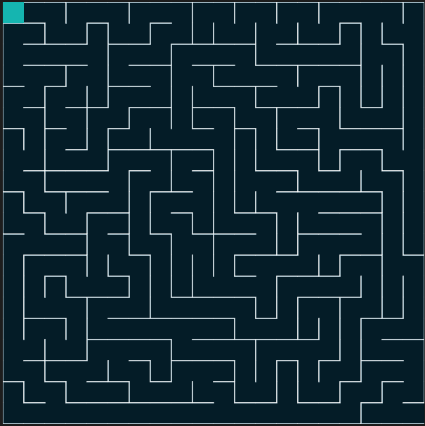

# Maze-Generator
A maze generator in p5.js using the depth-first-search-recursive-backtracker algorithm.

Some example results, respectively on a 10x10, 20x20 and 30x30 grid:

Here is a GIF I managed to make of it solving (now working!😊):

View on P5 web editor: https://editor.p5js.org/Nikhil_Sharma/sketches/bmnyzLce9
